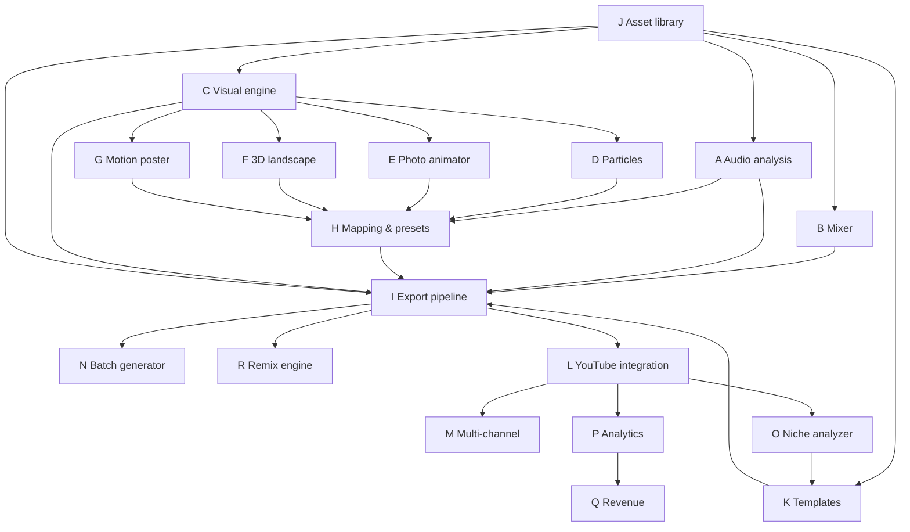
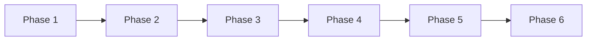

# Dependency Graph (Modules + Phases)

This doc provides the authoritative dependency DAG for modules A–R and the phase sequencing dependencies.

## Module DAG (text)

- A (Audio analysis) → H (Mapping)
- B (Mixer) → I (Export pipeline)
- C (Visual engine) → D/E/F/G (visual modes)
- D/E/F/G (visual modes) → H (register parameters; consume mapping)
- (C, H, A, B) → I (render + encode pipeline)
- J (Asset library) → (A, B, C, H, I, K, L, P, Q, R)
- K (Templates) → (I, L, N, R, M)
- I (Export pipeline) → (N, R, L)
- L (YouTube integration) → (M, P)
- P (Analytics) → Q (Revenue)

## Mermaid DAG (modules)

## Phase sequencing DAG

## Critical path summary (what blocks everything)

The project’s critical path is the export pipeline and everything it depends on:

1. **J Asset library** (provenance + managed storage)
2. **A Audio import + analysis** (canonical WAV + cached BPM/beat grid)
3. **H Mapping + presets** (stable parameter IDs; deterministic mapping)
4. **C Visual engine + at least one visual mode (G)** (preview ↔ export parity)
5. **I Render/export pipeline** (segmentation, resume, crash-safe, FFmpeg progress)
6. Only after the above are stable:
   - Phase 2 modes (D/E/F)
   - Phase 3 mixer (B)
   - Phase 4 automation (N/R)
   - Phase 5 YouTube (L/M)
   - Phase 6 analytics (O/P/Q)

## Phase dependencies (explicit)

- Phase 2 depends on:
  - Phase 1 export determinism + schema stability
- Phase 3 depends on:
  - Phase 1 segmentation/resume framework
- Phase 4 depends on:
  - Stable presets/mapping schema (Phase 2) and mixer (Phase 3)
- Phase 5 depends on:
  - Stable bundles and provenance outputs (Phase 1–4)
- Phase 6 depends on:
  - OAuth + channel bindings (Phase 5) and stable schema (Phase 1)
